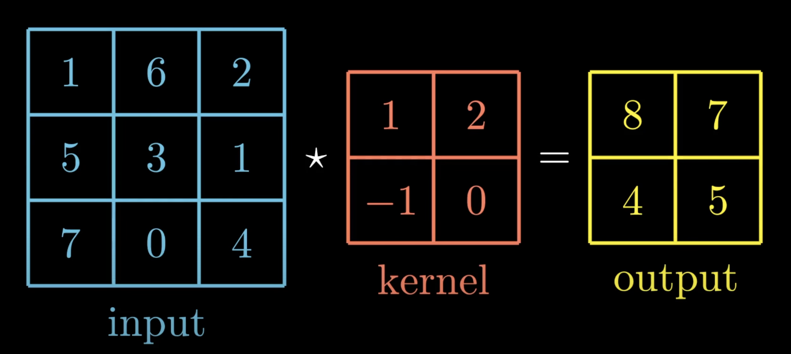
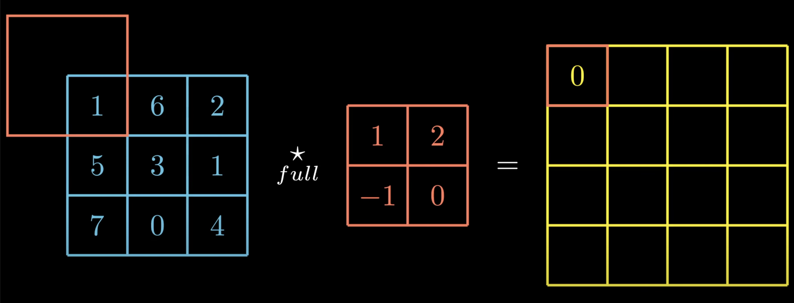
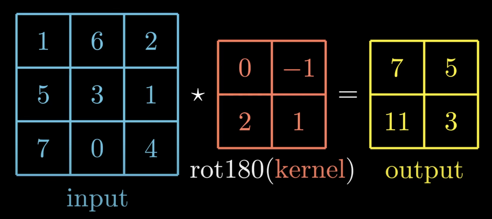

# Convolutional Neural Network from scratch
This is a basic Convolutional Neural Netowrk built from scratch only using `numpy` and `scipy` libraries.
The `MNIST` dataset is solved in this example.

## Usage

```py
from dense import Dense
from convolution import Convolutional
from reshape import Reshape
from activations import Sigmoid, Tanh
from losses import binary_cross_entropy, binary_cross_entropy_prime
from network import train, predict

# After splitting the input variable (x) and the output variable (y) into training and testing sets and preprocessing the data
# then proceed to define the neural network

# Neural network
network = [
    Convolutional((1,28,28),3, 5),
    Sigmoid(),
    Reshape((5, 26, 26), (5 * 26 * 26, 1)),
    Dense(5 * 26 * 26, 100),
    Sigmoid(),
    Dense(100, 2),
    Sigmoid()
]

epochs = 20
learning_rate = 0.1

train(
    network, 
    x_train, 
    y_train, 
    binary_cross_entropy, 
    binary_cross_entropy_prime, 
    learning_rate, 
    epochs, 
    True
)
```

## Working of the model
### Index
1. [Cross-correlation operation](#cross-correlation-operation)
2. [Convolution operation](#convolution-operation)
3. [Valid and Full Cross-correlation](#valid-and-full-cross-correlation)
4. [Convolution Layer](#convolution-layer)
5. Reshape layer
6. Binary Cross Entropy Loss
7. Sigmoid activation
7. Solve MNIST

### Cross-correlation operation
We're given two matrices, an input matrix and a kernel, which acts as a filter. Cross-correlation between the input matrix and the kernel will produce a output matrix. The values in the ouput matrix are obtained by sliding the kernel over the input matrix and calculating the product of adjacent values and summing them. 

The size of the output matrix can be calculated as follows

$ Y = I - K + 1 $

Where
- $Y$ is the size of output matrix
- $I$ is the size of input matrix
- $K$ is the size of kernel matrix

Example:
Consider the matrices shown in the above image, where size of input matrix is `3`, size of kernel is `2`. Hence, the size of output matrix is determined by

$
Y = I - K + 1 \\
Y = 3 - 2 + 1 \\
Y = 2
$

Therefore, the size of the output matrix is a square matrix of size `2`.

### Valid and Full Cross-correlation
**Valid Cross-correlation**

The operation shown above, that is, the cross-correlation operation performed by placing the kernel entirely on top of the input matrix is known as *Valid Cross-correlation* or *Valid Correlation*.

**Full Cross-correlation**

Performing cross-correlation as soon as there is an intersection between the input matrix and kernel is called *Full Cross-correlation* or *Full Correlation*.



The size of the output matrix can be calculated as follows

$ Y = I - K + 3 $

Where
- $Y$ is the size of output matrix
- $I$ is the size of input matrix
- $K$ is the size of kernel matrix

Example:
Consider the matrices shown in the above image, where size of input matrix is `4`, size of kernel is `2`. Hence, the size of output matrix is determined by

$
Y = I - K + 1 \\
Y = 4 - 2 + 3 \\
Y = 5
$

Therefore, the size of the output matrix is a square matrix of size `5`.


### Convolution operation
Convolution operation is performed by applying cross-correlation operation between the input matrix and 180° rotated kernel matrix.
> It is important to remember this key difference between `cross-correlation` and `convolution`


Mathematically, it can be written as

$Conv(I , K) = I * rot180(K)\\$

### Convolution Layer
A Convolution layer takes three dimensional block of data as a input. In that case, the depth of the input is `3`. 

## Initializations
* ### learning_rate:
  * Determines the step size at each iteration while moving toward a minimum of loss. A high value for this can cause overshooting, causing the model to be inaccurate and a low value could result in smaller steps towards local-minima, meaning slow convergence and requiring more iterations.
  * Default value: `0.01`
* ### epochs:
  *  A complete pass of a training dataset through a learning algorithm. During an epoch, the model learns from each example in the dataset and refines its weights and biases to improve accuracy.
  * Default value: `1000`


## Parameters
Parameters of the `train` method are as follows
* network:
  * ⚠️ Work in progress ⚠️

* x_train and y_train :
  * x_train is the preprocessed input variable and y_train is the preprocessed target variable for training the neural network.

* loss :
  * ⚠️ Work in progress ⚠️

* loss_prime :
  * Derivative of the loss function.

* Verbose :
  * Verbose is a flag variable thatis set to `True` by default, to display the loss after every epoch is completed.

## Working of the model
⚠️ Work in progress ⚠️

## Intuition
⚠️ Work in progress ⚠️
